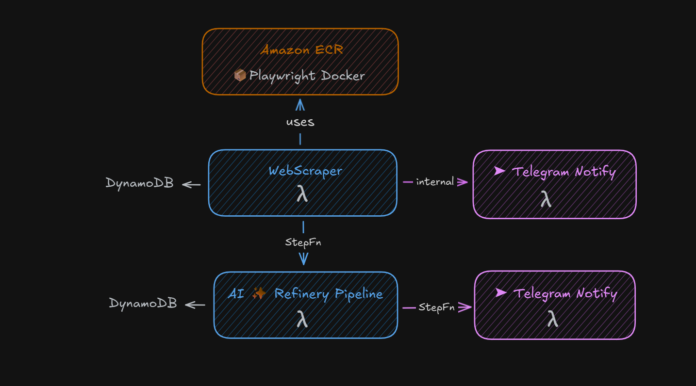

# 🕹️ Scraper Orchestrator  
⚙️ Serverless Step Functions to run and coordinate scraping workflows

## 🔄 Workflow Execution

The orchestrator runs a state machine that scrapes content, processes it, and notifies the result:

## 🏗️ Infrastructure

We coordinate the following AWS resources:

- **Amazon ECR** → hosts the Playwright Docker image  
- **WebScraper Lambda** → fetches raw content  
- **Refinery Lambda** → processes and stores structured data  
- **Telegram Notify Lambda** → sends success/failure alerts  

